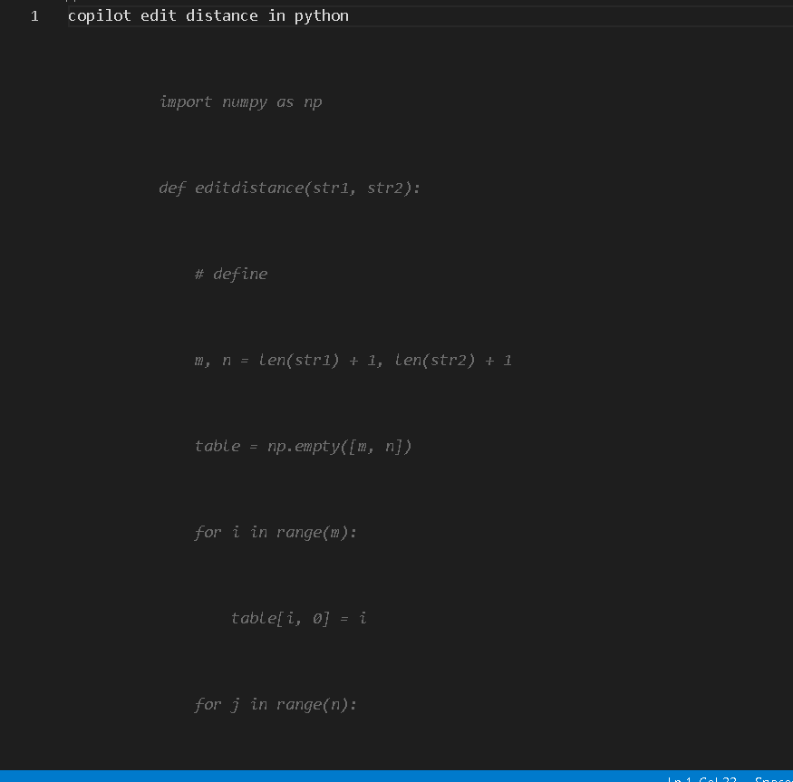

# Code Copilot 
this is a code copilot for vscode 

<br>

# how to use 
```
copilot 'equation' in 'language' press space it might take up to 5 seconds to make the code  
```


<br>

# how to launch 
1. you will need the vscode - insiders 
2. after opening it in vscode - insiders press 'F5' to start it
